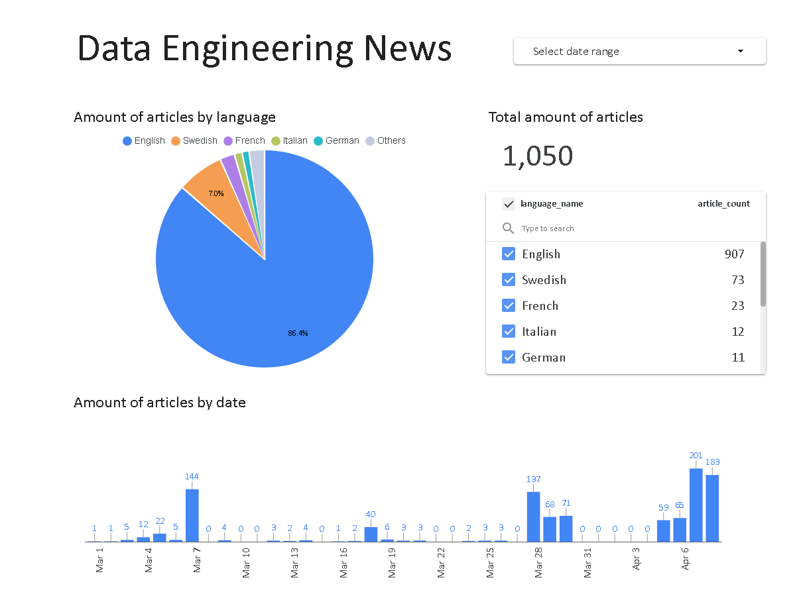

# Data Engineering News Pipeline with BigQuery, Kestra, dbt, and Looker Studio

## Project Description

This project builds an end-to-end data engineering pipeline that extracts news articles related specifically to "data engineering" from NewsAPI. Data is incrementally loaded into BigQuery using `dlt`, orchestrated by Kestra, transformed using dbt, and finally visualized in Looker Studio. The primary goal is to provide insightful analytics and visualizations on news trends, global coverage, and topic popularity.

## Data Sources

| Source  | Description                                       | Link                               |
|---------|---------------------------------------------------|------------------------------------|
| NewsAPI | News articles with keyword "data engineering"     | [newsapi.org](https://newsapi.org/) |

The NewsAPI was chosen for its straightforward API integration, free tier access for development, and extensive global news coverage.

## Technologies and Tools

| Category                | Tools                                           |
|-------------------------|-------------------------------------------------|
| Cloud Infrastructure    | Google Cloud Platform (GCP), Terraform          |
| Data Ingestion          | dlt (Data Load Tool), Python                    |
| Data Warehouse          | BigQuery                                        |
| Workflow Orchestration  | Kestra                                          |
| Data Transformation     | dbt (Data Build Tool)                           |
| Visualization           | Looker Studio                                   |
| Version Control         | Git, GitHub                                     |

## Architecture & Workflow

```
NewsAPI → dlt (Python) → BigQuery (raw data)
                      ↓
            Kestra orchestrates → dbt transformations → BigQuery (analytics-ready)
                      ↓
              Looker Studio dashboards
```

- **NewsAPI:** Source of articles containing "data engineering".
- **dlt:** Python-based incremental data ingestion into BigQuery.
- **BigQuery:** Data warehouse storing raw and transformed data.
- **Kestra:** Orchestrates daily data ingestion and dbt model execution.
- **dbt:** Transforms raw data into structured analytics tables.
- **Looker Studio:** Visualizes analytical data, providing actionable insights.

## Project Structure

```
news-data-pipeline/
├── terraform/                 # Infrastructure as code
│   ├── main.tf
│   ├── outputs.tf
│   ├── terraform.tfvars
│   └── variables.tf
├── kestra/                    # Kestra workflows definition
│   ├── extract_news.yml       
│   └── news_transform_dbt.yml 
├── dbt/                       # dbt project files
│   ├── news_transformations/  
│   │   ├── models/
│   │   │   ├── marts/
│   │   │   │   └── fct_daily_article_summary.sql
│   │   │   ├── staging/
│   │   │   │   └── stg_news_articles.sql
│   │   │   └── sources.yml
│   │   ├── seeds/
│   │   │   └── language_codes.csv
│   │   ├── dbt_project.yml
│   │   └── profiles.yml
├── visualizations/            # Dashboards and screenshots
│   ├── Data_Engineering_News.pdf
│   └── Screenshot.png
├── docker-compose.yaml        # Docker-compose file to run Kestra
└── README.md                  # Documentation
```

## Setup Instructions

### Prerequisites

- Google Cloud Platform account
- [Terraform](https://developer.hashicorp.com/terraform/install)
- Python 3.11
- [Docker](https://docs.docker.com/engine/install/) and [Docker-Compose](https://docs.docker.com/compose/install/)

### Infrastructure Setup

1. In the folder `Project/terraform`, rename file `terraform.tfvars.temp` to `terraform.tfvars`.
2. In this file, change the value to your project id in Google Cloud.
3. If needed, change default values of location and region in `variables.tf`.
4. Execute the following commands:
    ```bash
    cd Project/terraform
    terraform init
    terraform apply
    ```
    When the infrastructure is successfully set, in this folder will appear a file `dlt-service-account.json`. Which is needed for Kestra Setup (`GCP_Credentials`).
5. Execute the following commands to start Kestra:
    ```bash
    cd ..
    docker-compose up -d
    ```

### Kestra Setup

1. Open [Kestra](http://localhost:8080/) in the browser.
2. Set necessary KV variables (`GCP_Credentials`, `News_API`, `GCP_Dataset`, `GCP_Location`).
3. Import workflows `extract_news.yml` and `news_transform_dbt.yml` to Kestra UI.
4. The workflow `extract_news.yml` has multiple schedulled triggers to load the data daily for each language. To get more data from the part you have to run some backfill executions on the Triggers tab. Note, that News API doesn't allow to get data older than 1 month.
5. The workflow `news_transform_dbt.yml` has no triggers at the moment and have to be pushed manually. I didn't yet make up the way to guarantee trigger of this workflow after all "language" extraction runs will finish. 
    - Just to schedule it the last is one way, but if Kestra is started up after the schedule then all flows will run at the same time and won't guarantee the expected order.
    - Another way is to trigger it when the first flow `extract_news` is completed. But then it will run the same amount of times as there are languages which would not be a justified cost in a real-life project.

### Looker Studio Setup

You can clone my [Dashboard](https://lookerstudio.google.com/reporting/79a95d9e-7e23-4d9c-b68d-7d76925a00f2) (`Make a copy` button in the top right under `More options` button) and connect your BigQuery Dataset.

## Visualization

The Looker Studio dashboard visualizes:
- The total amount of articles published at the chosen period of time.
- The amount of articles published at the chosen period of time by language.
- The amount of articles published at the chosen period of time by day.

The date range filter allows you to choose the required period of time.
The list of languages allows to choose one or more languages to filter the visualised data.



## Future Improvements

- News Sources analysis.
- In some languages they write "data engineering" differently...
- Integration of Google Trends/Medium data for richer context.
- Real-time or near real-time streaming data ingestion.

## Challenges & Learnings

### Challenges
- Managing incremental loads with multiple languages.
- Authentication complexities in automated workflow orchestration.

### Learnings
- Effective orchestration with Kestra and dbt for scalable workflows.
- Best practices for handling incremental data ingestion with `dlt`.

